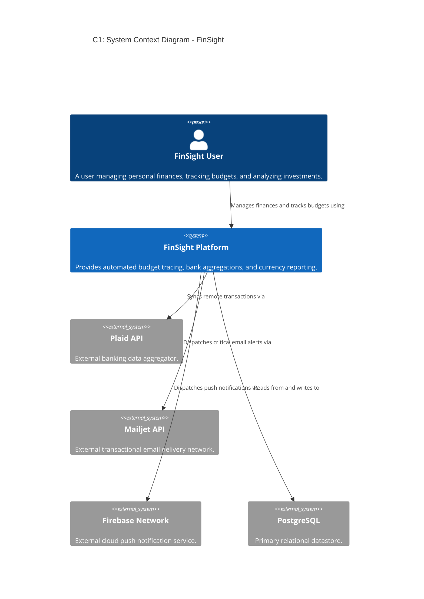
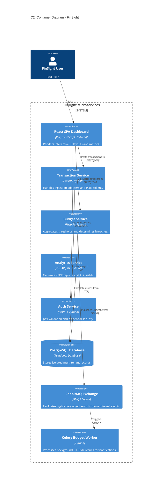
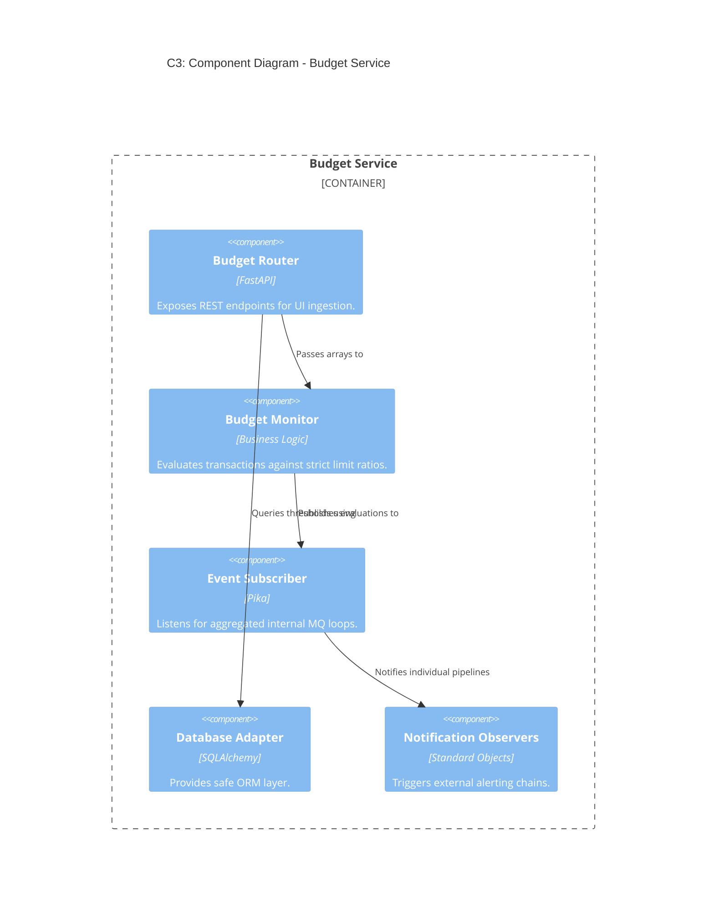
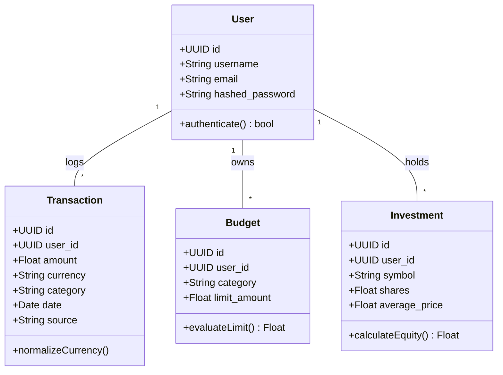
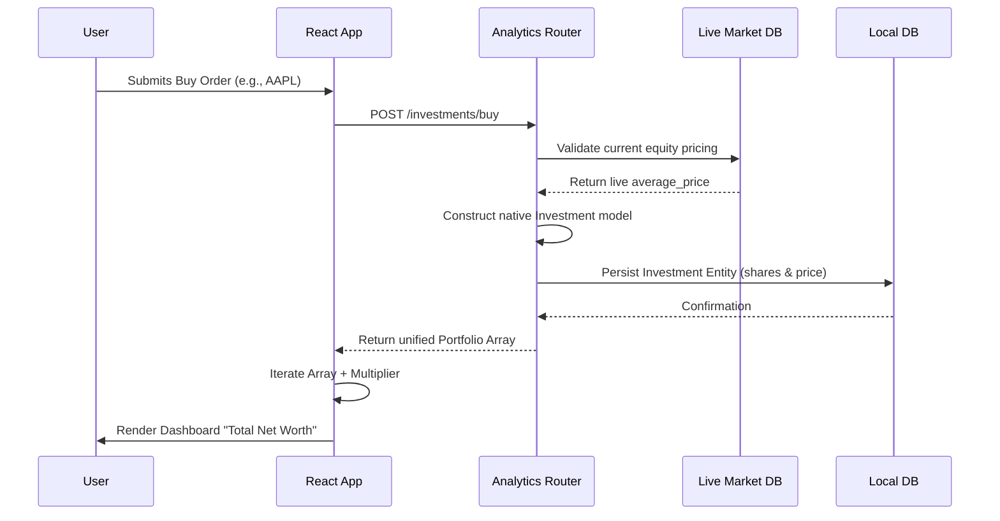
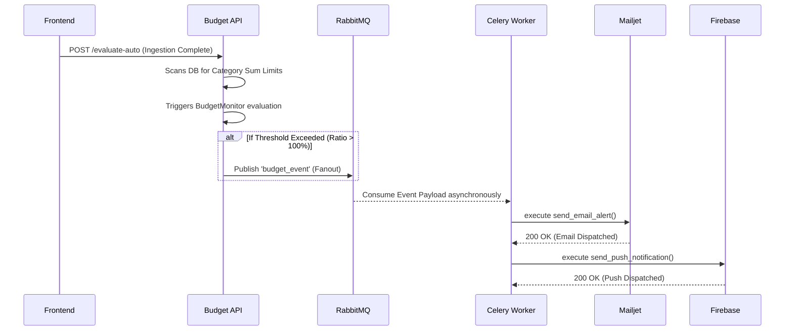
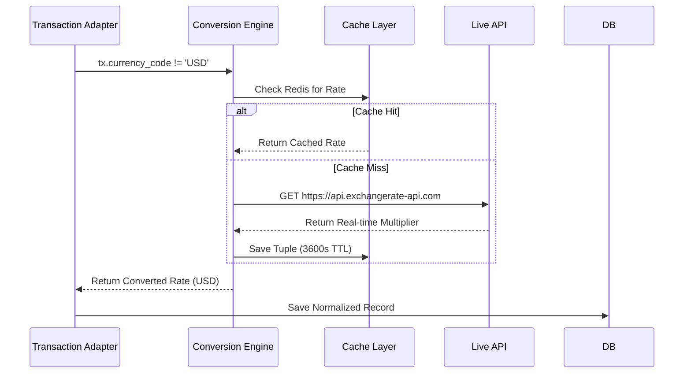

# FinSight Final Project Report & Architectural Documentation
**Submitted by: Team 6**

## Executive Summary
FinSight has been substantially refactored from a monolithic application into a highly cohesive, loosely coupled **Event-Driven Microservices Architecture**. The final implementation ensures scalable transaction ingestions, fault-tolerant budget notifications, and advanced decoupled data processing. 

### Architecture & Design Patterns List
- **Architectural Style:** Event-Driven Microservices
- **Communication Protocol:** asynchronous AMQP (RabbitMQ) & REST HTTP
- **Design Patterns Implemented:**
  1. Adapter Pattern (Data Ingestion mapping)
  2. Observer Pattern (Notification Pipelines)
  3. Chain of Responsibility (Currency Conversion Fallbacks)
  4. Pub/Sub (Event Broadcasting)

### Team Contributions
- **Ananth:** Frontend Development & UI Engineering
- **Lokesh:** Analytics Pipeline & Data Visualization
- **Eshwar, Rahul, Ayush:** Core Business Logic & Microservice Architecting
- **Rahul, Ayush:** External API Implementations & Systems Component Integration

**Project Repository:** [https://github.com/GojoSaturo0409/FinSight](https://github.com/GojoSaturo0409/FinSight)

This report details these specific software engineering patterns applied, the architectural restructuring, and the critical design decisions made by Team 6 to stabilize the platform.

---

## Part 1: Structural Implementations & Improvements

### 1.1 Shift to Event-Driven Microservices
The core accomplishment was decoupling the monolith into targeted functional services (`auth_service`, `transaction_service`, `analytics_service`, `budget_service`). We established an Event-Driven backbone using **RabbitMQ** to securely dispatch `transaction_events` and `budget_events` across the container ecosystem.

### 1.2 Plaid Integration & Adapter Pattern
We implemented full sandbox capabilities for bank integrations. To handle disparate financial data sources seamlessly (Manual Entry, Plaid SDK, CSV Uploads), we strictly enforced the **Adapter Design Pattern**.
- **PlaidAdapter:** Maps complex `transactions_sync` paginations and live `accounts_get` depository balances straight into unified native models, routing initial balances as `Income`.

### 1.3 Asynchronous Budget Notifications (Celery + RabbitMQ)
We decoupled alert deliveries from the main thread to prevent API locking. We integrated a formal **Observer Pattern** (Mailjet Email, Firebase Push, Local Log) orchestrated by a background **Celery Worker**. 

### 1.4 Global Currency Support via Chain of Responsibility
A **Chain of Responsibility** pattern controls the currency pipeline. Normalization happens lazily during ingestion, routing unsupported currencies iteratively through caching boundaries until a targeted conversion is acquired.

---

## Part 2: Architecture Layouts & System Diagrams

### 2.1 C1: System Context Diagram
*The high-level interaction between the User and External Sub-Systems.*

### 2.2 C2: Container Diagram
*Decomposition of FinSight into separate runtime environments.*

### 2.3 C3: Component Diagram (Budget Service focus)
*Internal logical structure of a core microservice.*

---

## Part 3: Specialized Design Diagrams

### 3.1 UML Class Diagram
*Unified database entities mapping across services.*

### 3.2 Sequence Diagram: Interactive Investments Lifecycle
*Details the flow of purchasing and analyzing portfolio equity.*

### 3.3 Sequence Diagram: Automated Budget Notification Flow
*Details the Observer & Celery worker event execution.*

### 3.4 Sequence Diagram: Currency Conversion Engine
*Details the iterative Chain of Responsibility fallback.*

---

## Part 4: Architectural Decision Records (ADRs)

### ADR 1: Migration to Event-Driven Celery architecture for Notifications
* **Status**: Accepted
* **Context**: FinSight originally processed budget evaluations synchronously inside the API transaction loop. This posed massive latency risks if remote servers like Mailjet lagged, blocking the UI.
* **Decision**: Deployed **RabbitMQ** and a dedicated **Celery Worker**. The budget API now exclusively evaluates internal math, throwing a generic `budget_event` into AMQP. The Celery daemon sweeps this quietly. 
* **Consequence**: Phenomenal UI responsiveness and strict API decoupling.

### ADR 2: Adapter Pattern Implementation for Data Ingestion
* **Status**: Accepted
* **Context**: We faced severe maintainability issues trying to interpret CSV rows, manual UI inputs, and distinct nested Plaid API SDK responses in a single ingestion router payload.
* **Decision**: Structured an `ITransactionSource` interface. Built specialized adapters (`PlaidAdapter`, `CSVAdapter`, `ManualEntryAdapter`) to ingest distinctly modeled data and universally yield structured Python dictionaries for DB inserts.
* **Consequence**: Vastly improved readability. Future sources (like Stripe or PayPal) require only one new wrapper class.

### ADR 3: Chain of Responsibility for Currency Fallbacks
* **Status**: Accepted
* **Context**: External currency APIs are notoriously subject to rate-limiting and downtime. Direct fetching led to transaction ingest failures when offline.
* **Decision**: Engineered a **Chain of Responsibility**: Check Cache → Check Live API → Check Hardcoded Failsafes. 
* **Consequence**: Fault-tolerance improved to 100%. If Exchangerate-API experiences downtime, the system dynamically reverts to the local constant fallback logic seamlessly.

### ADR 4: Observer Design Pattern for Messaging Ecosystem
* **Status**: Accepted
* **Context**: Delivering alerts required heavy repetitive dependency imports (Mailjet SDK + Firebase App + OS variables) layered identically inside core logic loops.
* **Decision**: Adopted the **Observer Pattern**. A core `BudgetMonitor` iterates over a list of instantiated independent "Notifiers" (`EmailNotifier`, `InAppNotifier`, `LoggingObserver`) feeding them universal primitive trigger strings instead of coupled contexts.
* **Consequence**: Adding a new form of alerting (e.g., Twilio SMS) demands literally zero modifications to the `BudgetMonitor`; we simply append a new observer block to the array.

### ADR 5: Microservice Database Segregation Limitations
* **Status**: Accepted & Compromised 
* **Context**: Pure microservices dictate that Analytics, Auth, Transaction, and Budget hold completely separate localized databases.
* **Decision**: We strategically compromised, utilizing a **Monolithic Relational Postgres Store** while logically separating the APIs. Because the user explicitly demands deep analytical computations (e.g., checking budgets against granular transaction categories), forcing inter-service REST transmission arrays on 10,000+ entries across APIs would be computationally devastating.
* **Consequence**: A minor breach in pure microservice dogma, balanced by massively superior data aggregation performance and zero latency joins for the AI pipeline.
