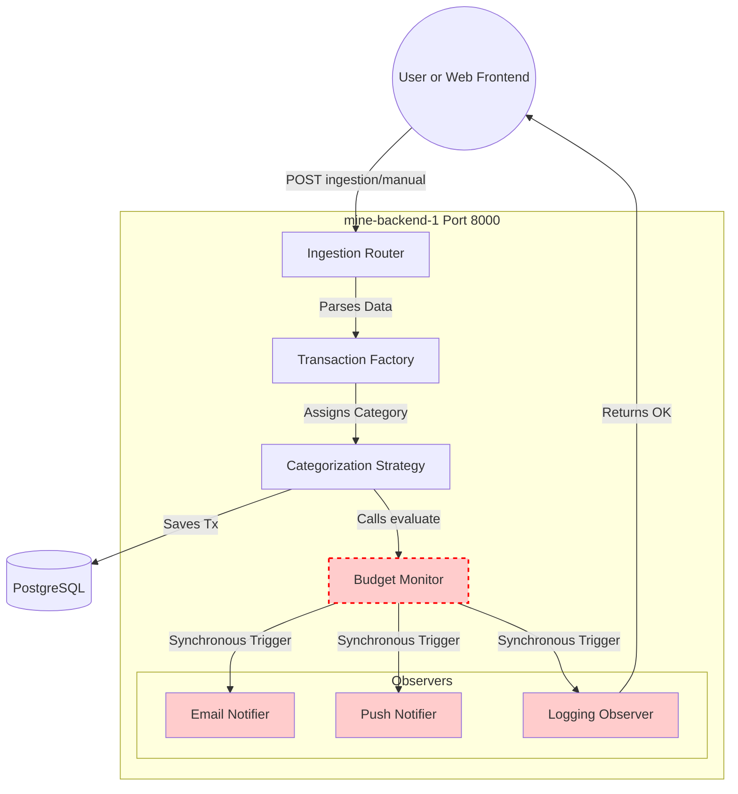
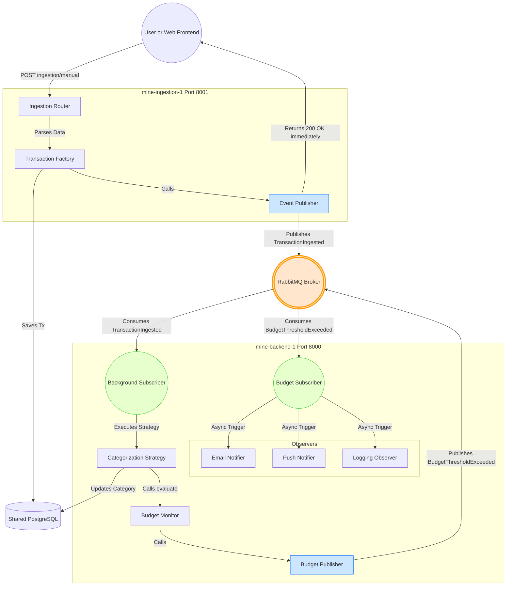

# FinSight Architecture Flowcharts

The following diagrams illustrate how the data execution flows in the system both before and after the transition to the Event-Driven Architecture.

## 1. Before: Tightly Coupled Monolith (Synchronous)

In the initial state, all routes and logic handlers (Ingestion, Categorization, Budgeting) were processed procedurally on a single server block (`mine-backend:8000`). When a transaction was added, the API blocked the user's requesting thread until all observer pattern notifications (Email, Push, Logging) consecutively finished.

## 2. After: Pragmatic Event-Driven Architecture (Asynchronous)

In the revised state, we isolated the **Ingestion Service** (`mine-ingestion:8001`) from the **Core Logic** (`mine-backend:8000`). We introduced a **RabbitMQ** Message Broker to decouple processes via Pub/Sub. When user transactions hit the ingestion gateway, it commits to the DB and fires an asynchronous event (`TransactionIngested`) without blocking the user. Core background tasks pull these events and independently alert the end-user via `BudgetThresholdExceeded` events recursively.

